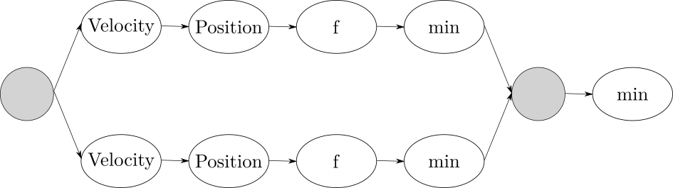

# Parallel architecture design

```python
while not termination:
  tmp_glb_min = INF
  for p in particles:
    p.update_velocity ( global_min )
    p.update_position ()
    p.update_value ( user_function )
    if p < p.local_min:
      p.local_min = p
      if p < tmp_glb_min:
        tmp_glb_min = p

  if tmp_glb_min < global_min:
    global_min = tmp_glb_min
```

The algorithm execution consists of a number of iterations determined by a certain termination condition, for the sake of simplicity this is a integer provided by the user.
Because of the constant and minimum contribution to the performance, the parallelization of the work needed to compute the initial state of the system has not been addressed in this report nor in the implementation.

Identifying the dependencies allows a **functional deconstruction** of the body of the loop:

- the update of the *"minimum particles"* depends on the value of the user provided function in the point
- the value depends on the current position of the particle
- the position depends on the current velocity
- the velocity of a particle depends on the local and global minimum

Each iteration computes a candidate to be the global minimum of a certain real function; the computation depends on the result of the previous one, so a **barrier** must exist to insure coherency.
As in the sequential pseudo-code, where the global minimum is chosen after all the particles have contributed to compute the state.

Given these dependencies, it's possible to benefit of a **pipeline introduction**.

The vector nature of the problem, given by the position and the speed of an object in a multidimensional space, is prone to the use of **vectorization** to parallelize the computation in independent dimensions.
For the vectorization to be effective the operations to limit the boundaries of the solution space could be limited by the ALU's architecture, for example the modulo operator useful to provide a toroidal space couldn't be available, so this choice has to be experimental evaluated.

Whilst the external loop can't be parallelized because of the dependency between consequent states, the internal one is fully exploitable using a farm because of the independent nature of the particles.
Once all the particles have been computed by the farm workers, the global minimum can be updated.

```
Pipe (
  Farm ( 
    Pipe (
      velocity,
      position,
      f,
      min
    )
  ),
  min
)
```



# Performance model

Given $n$ as the number of particles and $m$ the number of iterations to compute, the expected sequential time is:

$$
T_{seq} = m * ( n ( 2 T_{vel} + 2 T_{pos} + T_{f} + T_{min} ) + T_{min} )
$$

As previously discussed, the $m$ factor can't be exploited via parallelization, so the performance analysis could be done referencing only the internal loop used to compute a certain state.

In the sequential case this takes:

$$
T_{c} = n ( 2 T_{vel} + 2 T_{pos} + T_{f} + T_{min} ) + T_{min}
$$

After the vectorization and the internal pipeline introduction the latency and the service time should vary like this:

$$
L = T_{vel} + T_{pos} + T_{f} + T_{min} + T_{min}
$$
$$
T_s = max ( T_{vel} , T_{pos} , T_{f} , T_{min} )
$$
$$
T_{c} \approx n * T_{s}
$$

The farm introduction with $n_{w}$ workers is useful to hopefully reduce the service time of an $n_{w}$ factor, leading to a completion time of:

$$
T_{c} \approx \frac{ n * T_{s} }{ n_{w} }
$$

# Implementation details

# Experimental results
