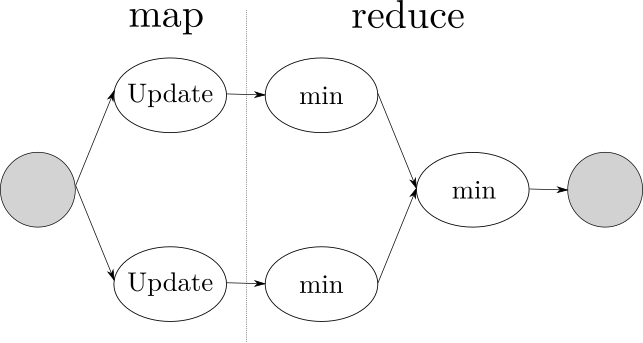
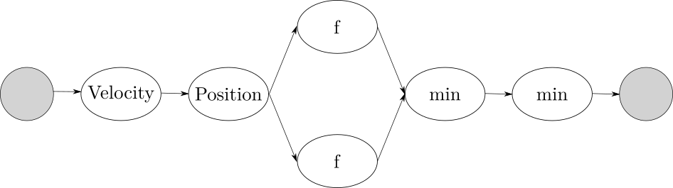

# Parallel architecture design

```python
while not termination:
  tmp_glb_min = INF
  for p in particles:
    p.update_velocity ( global_min )
    p.update_position ()
    p.update_value ( user_function )
    if p < p.local_min:
      p.local_min = p

  for p in particles:
    if p.local_min < global_min:
      global_min = p.local_min
```

The algorithm execution consists of a number of iterations determined by a certain termination condition, for the sake of simplicity this is a integer provided by the user.
Because of the constant and minimum contribution to the performance, the parallelization of the work needed to compute the initial state of the system has not been addressed in this report nor in the implementation.

## General considerations

Each iteration computes a candidate to be the global minimum of a certain real function; the computation depends on the result of the previous states, so a **barrier** must exist to insure coherency.

The vector nature of the problem, given by the position and the speed of an object in a multidimensional space, is prone to the use of **vectorization** to parallelize the computation in independent dimensions.
For the vectorization to be effective the operations to limit the boundaries of the solution space could be limited by the ALU's architecture, for example the modulo operator useful to provide a toroidal space couldn't be available, so this choice has to be experimental evaluated.

## MapReduce

A possible approach is to use the MapReduce pattern to parallelize the computation of a state.

The *map* function should take a particle, update its internal state and return a reference to the local minimum.

$$
f: \textrm{particle} \rightarrow \textrm{result}
$$

It's possible to describe the *reduce* phase as the phase where all the local minimums are compared, generating the new global minimum.

$$
min: \textrm{result} \times \textrm{result} \rightarrow \textrm{result}
$$



## Pipeline

Identifying the dependencies allows a **functional deconstruction** of the body of the loop:

- the update of the *"minimum particles"* depends on the value of the user provided function in the point
- the value depends on the current position of the particle
- the position depends on the current velocity
- the velocity of a particle depends on the local and global minimum

Given this functional dependencies, it could be instead possible to benefit of a **pipeline introduction** using a *scatter* to generate a stream from a collection.


Since the user provided $f$ function can be arbitrarily complex its service time could easily become the bottleneck of the pipeline.
The confirmation of this intuition and the evidence of other bottlenecks could emerge during the *profiling* phase after the implementation.
The performance could benefit so of a **farm introduction**.



# Performance model

Given $n$ as the number of particles and $m$ the number of total iterations to compute, the expected sequential time is:

$$
T_{\textrm{seq}} = m * n ( T_{v} + T_{p} + T_{f} + 2 T_{m} )
$$

As previously discussed, the $m$ factor can't be exploited via parallelization, so the performance analysis could be done referencing only the internal loop used to compute a certain state.

In the sequential case this takes:

$$
T_{\textrm{seq}} = n ( T_{v} + T_{p} + T_{f} + 2 T_{m} )
$$

## Comparison

$$
T_{\textrm{MapReduce}} = \frac{n}{n_w} ( T_v + T_p + T_f + 2 T_m ) + n_w * T_m 
$$
$$
L = T_v + T_p + T_f + 2 T_m
$$
$$
T_s = \max ( T_v , T_p , T_f , T_m )
$$
$$
T_{\textrm{Pipe}} \approx n * T_{s} = n * \max ( T_v , T_p , T_f , T_m )
$$
$$
T_{\textrm{PipeFarm}} \approx n * \max ( T_v , T_p , \frac{T_f}{n_w} , T_m )
$$

# Implementation details

# Experimental results
