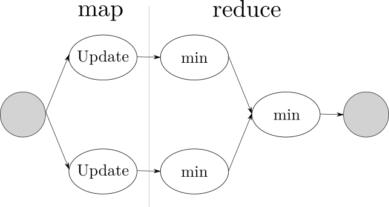

# Parallel architecture design

The algorithm approximates the minimum value of a real function $f$ via several iterations of a procedure that updates a set of particles, the number of iterations $m$ can be fixed or derived by a certain termination condition.
Because of the constant contribution to the performance, the parallelization of the work needed to compute the initial state of the system has not been addressed in the implementation or the report.

Each iteration computes a candidate to be the global minimum of a certain real function, the result depends on the previous candidate, so iteration computations must be serialized;
the update of the particles' internal state is instead embarrassing parallel because of their independence.

The vector nature of the problem, given by the position and the speed of an object in a multidimensional space, is prone to the use of **vectorization** to parallelize the computation in independent dimensions.

## Data parallel solution

A possible approach is to combine the **map** and the **reduce** high-order functions to parallelize the computation of a state.

The elemental function $el$ used by the map should take a particle and, given the previous global minimum candidate, update the particle internal state and return a reference to its local minimum.

$$
\textrm{el}: \textrm{particle} \rightarrow \textrm{result}
$$

Given that the global minimum is always the minimum of the local minimums of all the particles, it's possible to reduce the result from the updated particles using the following combiner function.

$$
\min: \textrm{result} \times \textrm{result} \rightarrow \textrm{result}
$$

A two-phase reduction with a local reduction of a chunk and a global reduction for all the results is feasible because of the benefits of fusing map and reduce like avoiding the need for synchronization;
this solution doesn't present precision problems because of the nature of the minimization operator, so it's possible to avoid a more complex and expensive tree-based reduction.

## Stream parallel solution

Identifying the data dependencies allows a functional deconstruction of the body of the loop:

- the update of the local minimum of a particle depends on the result of the user-provided function
- the computed value depends on the current position of the particle
- the position depends on the current velocity
- the velocity of a particle depends on the local and global minimum

Given these functional dependencies, it could be possible to benefit from a pipeline introduction using a first stage capable to generate a stream from a collection.

Since the user-provided $f$ function can be arbitrarily complex its service time could easily become the bottleneck of the pipeline, the performance could benefit so from a farm introduction.

# Performance model

Given $n$ as the number of particles and $m$ the number of total iterations to compute, the expected sequential time is:

$$
T_{\textrm{seq}} = m * n ( T_{v} + T_{p} + T_{f} + 2 T_{m} )
$$

As previously discussed, the $m$ factor can't be exploited via parallelization, so the performance analysis could be done referencing only the internal loop used to compute a certain state.

In the sequential case this takes:

$$
T_{\textrm{seq}} = n ( T_{v} + T_{p} + T_{f} + 2 T_{m} )
$$
The performances of the proposed solutions are easily comparable in terms of completion time for each iteration.

$$
T_{\textrm{map-reduce}} = \frac{n}{n_w} ( T_v + T_p + T_f + 2 T_m ) + n_w * T_m 
$$

In the pipeline solution, the estimated service time leads to the completion time for a high $n$ value.

$$
T_s = \max ( T_v , T_p , T_f , T_m )
$$

$$
T_{\textrm{Pipe}} \approx n * T_{s} = n * \max ( T_v , T_p , T_f , T_m )
$$

After the farm introduction to avoid the $f$ bottleneck the estimated completion time becomes:

$$
T_{\textrm{PipeFarm}} \approx n * \max ( T_v , T_p , \frac{T_f}{n_w} , T_m )
$$

Assuming that a high number of particles is involved in the computation, that the $f$ complexity requires significant time and that the remaining time usage isn't significant, both the PipeFarm and the map-reduce solutions are practically equivalent.

However it has to be considered that the communication needed between the stages in the pipeline solution and the effort needed to generate a stream from a collection, could produce a consistent overhead not present in the data-parallel solution.
Furthermore the possible adjustments to mitigate the pipeline overhead problem, as the fusion of the faster stages, would lead to a normal form stream-parallel pattern that resembles the data-parallel proposed solution except for the extra requirement to generate a stream.
Even in this scenario has to be considered that the update of the global minimum has to be done by locking the corresponding variable for each particle update, while in the data-parallel the same operation is lock-free.

For these reasons, the data-parallel solution is favorable and it's been chosen for the implementation phase. The expected performances are strictly dependent of the time complexity of the $f$ function to minimize, the greater the complexity the lower the serial fraction will be benefiting the speedup.

\begin{figure}[!htb]
\includegraphics[width=\linewidth]{img/ideal.png}
\caption{Ideal speedup with different serial fractions and overhead linear to the number of workers}\label{fig:affinity_trend}
\end{figure}

# Implementation details

The business logic is modeled using two data structures described in the `spo.hpp` file:

- `result_t`, stores the coordinates of a certain point and the value of the user-provided function in the same point.
- `particle_t`, keeps track of the velocity of a particle other than the results obtained in the current and the local minimum positions.

The set of particles is stored in an array of structures.
Because the same worker needs to read and write different members of the same `particle_t` structure there is no use for a structures-of-array solution that, without evident performance advantages, only breaks data encapsulation.

To update the particle set is used a lambda function that sequentially applies all the operations needed to compute the current velocity, position, value, and local minimum.
The function chosen to be minimized is the following:

$$
f(x,y) = \int_x^y \sin(t) dt
$$

The function presents a unique global minimum in the interval $x,y \in \left[ 0, 4 \right]$ and its computational time cost can be arbitrarily adjusted by setting the precision of the Riemann sum used to approximate it.

Given the report[^vectorization_report] generated by the GNU compiler using the `-fopt-info-vec-all` flag not all the `for` loops can be vectorized:

- The update of the velocity can't be vectorized due to the random number generation; even storing in an external vector the result of the random generation before the loop doesn't produce vectorization because of the "loop costings not worthwhile", as g++ notified.
- No issues appear in the vectorization of the computation of the position, but the subsequent control of space's boundaries isn't vectorizable due to the internal loops without a fixed number of iterations needed.

`main.cpp` is used to merge the business logic and the parallelization mechanism, depending on the $n_w$ provided it can sequentially compute the swarm particle optimization ( $n_w = 0$ ), or in parallel using the map-reduce or the FastFlow approach.
Both the queues used for the communication between threads and the class used to monitor times are the "standard" ones used for the PDS course, respectively in the `queue.hpp` and `utimer.hpp` files.

After setting the variable `$FF_ROOT` to the FastFlow current path in the Makefile, the project is compilable using the `make` command.
The utility `autotime.sh` can be used to keep track of the times of an experiment executing the `spo` software with an increasing number of workers and storing the results in a dedicated folder.
Without adding redundant information to this report is possible to see the required argument list by calling `spo` or `autotime.sh` without any argument.

## Map-reduce

The combination of map and reduce is implemented in the `mapreduce.hpp` file.
The class `MapReduce` initialize a thread pool in the construction phase and reuses the workers in all the subsequent calls, this behavior avoids the expensive creation of one or more threads for each iteration.
The method `compute( result_t ref )` is used to perform an iteration and so to obtain the global minimum value computed by applying map and reduce to all the particles, using `ref` as the current global minimum.

To notify the start of a new iteration or the termination of the procedure, the main thread communicates to the workers via a set of queues.
Each worker is responsible of the computation of a certain fixed size chunk in the collection of particles, for each element it applies the provided elemental function and computes a local reduction, the result of this local reduction is pushed inside a queue where the main thread pops from to conclude the reduce phase.

An alternative approach could have been to instantiate a unique queue, used by the main thread to push the coordinates of a chunk to the workers.
This solution has been implemented and tested, but has not been choose as default so it is applicable via git using the command `git apply queue.patch`.

Also by default the `MapReduce` constructor doesn't force the correlation between threads and cores, but this can be demanded by the user at compile time using an optional boolean argument when creating the object that provokes the constructor to call `pthread_setaffinity_np` for each thread.
 
## FastFlow

The FastFlow solution uses the `ParallelForReduce` class to instantiate $n_w$ threads and reuse them to map the update function to all the particles and subsequently to obtain the global minimum via reduction of the local minimums.
As in the C++ threads solution, the map and the local reduction are executed sequentially in the first local phase and the scheduling policy is with a chunk size given by the number of particles divided by the number of active workers.

# Experimental results

The performance metrics are directly influenced by the three factors:

- The precision of the Riemann sum that increases the $t_f$ time and consequently the time needed to update the state of a particle.
- The number of particles involved in the optimization process
- The correlation between threads and cores

Different experiments have been computed on the Xeon machine available for test\textsuperscript{(fig\ref{fig:experiments})}, all the raw data from the experiments are stored in the `./experiment/` folder included in the archive.

\begin{figure}[!htb]

\begin{tabular}{l*{6}{c}r}
Codename          & Particles & Iterations & Precision & Max Workers \\
\hline
big\_p10 &100000 &100 &0.1 &128 \\ 
little\_p10 &1000 &100 &0.1 &128 \\ 
little\_p10000 &1000 &100 &0.0001 &128 \\
\end{tabular}

\caption{Experiments}\label{fig:experiments}
\end{figure}

## Precision

By increasing the precision of the Riemann sum what is achieved is the reduction of the non-parallelizable serial fraction of the work, this according to the Amdahl's Law raises the theoretical speedup's upper boundary.
The phenomena can be appreciated in the two experiments where a little particle set ($10^3$) is used to compute the minimum of the definite integral\textsuperscript{(fig\ref{fig:precision})}.

## Workload 

The Gustafson's Law states that increasing the workload of an application influences the parallelizable serial fraction more than the non-parallelizable one.
A practical application of this law can be observed by increasing the dimension of the particle set\textsuperscript{(fig\ref{fig:workload})}, where the two experiments share the same precision and the one with the biggest set has a significant better speedup trend.

## FastFlow

As a general trend the custom `map-reduce` solution outperforms the `ParallelForReduce` method offered by FastFlow in all the different experiments, this could be caused by additional work needed by the framework.
Disabling the scheduling[^method] to make the FastFlow solution behave like the custom one doesn't seem to produce noticeable changes in term of performances.
The biggest gap in the speedup trend is noticeable when the particle set is small \textsuperscript{(fig\ref{fig:workload})}, and this also afflicts the efficiency\textsuperscript{(fig\ref{fig:fastflow})}. 

## Queues

Applying the patch to change the number of queues used doesn't dramatically change the performance, nonetheless the patched version seems to perform worse than the one with a queue per worker\textsuperscript{(fig\ref{fig:queues})}.
This difference should be caused by the high number of threads waiting on the same condition variable.

## Affinity

Generally binding each thread to a fixed core results in slightly better in performances than leaving the operating system the responsibility to assign them in a dynamic way.
The gap is consistent when the number of workers is inferior to the number of physical threads of the machine \textsuperscript{(fig\ref{fig:affinity_trend})}.
Given that each thread works always on the same chunk, there are cache's benefit in sticking the thread to a core reducing the memory faults and consequent accesses.

Without the informations that the OS has on all the processes in execution on the machine and the usage esteem for each core in time, the relation thread-core can also produce unpredictable negative results, producing a less linear performance trend\textsuperscript{(fig\ref{fig:affinity_case})}.

\begin{figure}[!htb]
  \includegraphics[width=\linewidth]{img/precision.png}
  \caption{Same size, different precision}\label{fig:precision}
  \includegraphics[width=\linewidth]{img/workload.png}
  \caption{Same precision, different size}\label{fig:workload}
\end{figure}

\begin{figure}[!htb]
\includegraphics[width=\linewidth]{img/fastflow.png}
\caption{Efficiency comparison between FastFlow and the custom solution}\label{fig:fastflow}
\includegraphics[width=\linewidth]{img/queue.png}
\caption{Same experiment, different communication}\label{fig:queues}
\end{figure}

\begin{figure}[!htb]
\includegraphics[width=\linewidth]{img/affinity_trend.png}
\caption{General scalability trend with or without core affinity}\label{fig:affinity_trend}
\includegraphics[width=\linewidth]{img/affinity_case.png}
\caption{Unpredictable jumps in the scalability trend}\label{fig:affinity_case}
\end{figure}

[^vectorization_report]: A partial extract of the report can be found in the `vectorization.log` file.
[^method]: `.disableScheduling()`
